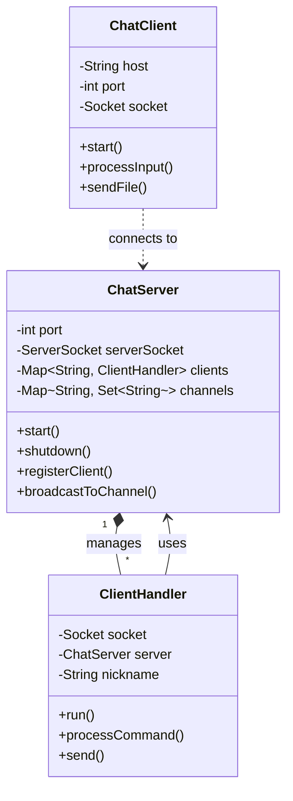

# CLI Chat Application - Technical Report

## 1. Introduction
The objective of this project was to design and implement a command-line interface (CLI) chat application that facilitates real-time communication between multiple users. The system consists of a central server and multiple client applications. The problem addresses the need for a lightweight, text-based communication tool that supports both public group chats (channels) and private direct messages, as well as file transfers. The scope of the solution includes handling concurrent user connections using TCP sockets, defining a custom application-layer protocol, and ensuring reliable data transmission.

## 2. Related Work
Chat applications have evolved significantly since the early days of the internet.
- **IRC (Internet Relay Chat)**: One of the earliest and most influential chat protocols. It uses a client-server model with a text-based protocol (RFC 1459). Our project draws heavy inspiration from IRC, adopting similar commands like `NICK`, `JOIN`, `PART`, and `PRIVMSG` (mapped to `MSG` and `CHAN`). IRC's strength is its simplicity and extensibility, though it lacks built-in encryption in its original specification.
- **XMPP (Extensible Messaging and Presence Protocol)**: A more modern, XML-based protocol used by services like WhatsApp (internally) and Google Talk. It is robust but significantly more complex to parse and implement than a line-based protocol.
- **Slack/Discord**: Modern proprietary platforms that use WebSockets and HTTP APIs. While feature-rich, they require heavy client applications and complex backend infrastructure.

Our solution opts for an IRC-style line-based protocol over TCP because it offers the best balance of simplicity and functionality for a CLI environment, allowing for easy debugging and implementation without the overhead of XML or JSON parsing libraries.

## 3. Method: Analysis and Design

### 3.1 Architecture
The system follows a classic Client-Server architecture.
- **Server**: Acts as the central hub. It listens on a specific port (default 6667) for incoming TCP connections. It maintains the state of all connected users and active channels.
- **Client**: Connects to the server, sends user commands, and displays incoming messages.

### 3.2 Class Design (UML Concepts)
- **`ChatServer`**: The main server class.
    - *Responsibilities*: Manages the `ServerSocket`, accepts new connections, and maintains a registry of `ClientHandler` instances (`Map<String, ClientHandler>`) and channels (`Map<String, Set<String>>`).
    - *Key Methods*: `start()`, `broadcastToChannel()`, `registerClient()`.
- **`ClientHandler`**: A `Runnable` class that handles a single client connection.
    - *Responsibilities*: Reads commands from the client socket, processes them according to the protocol, and sends responses. It runs in its own thread to ensure non-blocking handling of multiple clients.
    - *Key Methods*: `run()`, `processCommand()`, `handleMsg()`, `handleFile()`.
- **`ChatClient`**: The client application.
    - *Responsibilities*: Connects to the server, reads user input from the console, and sends it to the server. It also spawns a separate thread (`MessageReceiver`) to listen for incoming messages from the server asynchronously.
    - *Key Methods*: `start()`, `processInput()`, `sendFile()`.

### 3.3 UML Class Diagram

### 3.4 Protocol Design
The protocol is text-based, using newline-terminated strings.
- **Commands**: `COMMAND <args>` (e.g., `JOIN #general`, `MSG alice Hello`).
- **Responses**: `RESPONSE <code> <message>` (e.g., `OK JOIN Joined #general`, `ERROR 404 User not found`).
- **File Transfer**: Uses a specific handshake.
    1. Sender sends `FILE <recipient> <filename> <size>`.
    2. Server validates and forwards `FILEOFFER` to recipient.
    3. Sender waits for `OK FILE` from server (indicating readiness).
    4. Sender transmits raw binary data.
    5. Server relays binary data to recipient.

### 3.4 Concurrency
- The server uses a **Thread-per-Client** model. Each connected client is assigned a dedicated thread (`ClientHandler`).
- Shared resources (user lists, channel maps) are managed using thread-safe collections like `ConcurrentHashMap` and `ConcurrentHashMap.newKeySet()` to prevent race conditions during concurrent access.
- The client uses two threads: the main thread for reading user input and a background thread for receiving server messages, allowing full-duplex communication.
- The client uses two threads: the main thread for reading user input and a background thread for receiving server messages, allowing full-duplex communication.

### 3.5 Security Implementation
To address the vulnerability of plaintext communication, we implemented two key security features:
1.  **SSL/TLS Encryption**:
    - Replaced standard `Socket` and `ServerSocket` with `SSLSocket` and `SSLServerSocket`.
    - Generated a self-signed RSA certificate (`chat.jks`) using Java's `keytool`.
    - This ensures all data transmitted (messages, files, commands) is encrypted and cannot be sniffed by attackers on the network.
2.  **Server Authentication**:
    - Implemented a password protection mechanism.
    - The server can be started with a password argument.
    - Clients must send an `AUTH <password>` command as the very first step.
    - The `ClientHandler` enforces this state; any other command sent before successful authentication results in an error.
## 4. Discussion

### 4.1 Strong Points
- **Simplicity**: The text-based protocol is human-readable, making it easy to debug using tools like `telnet` or `netcat`.
- **Concurrency**: The use of `ConcurrentHashMap` ensures thread safety without the performance bottleneck of synchronizing the entire server methods.
- **Reliability**: The file transfer mechanism includes a handshake (waiting for `OK FILE`) to prevent data loss caused by buffering race conditions, ensuring binary data is not misinterpreted as text commands.

### 4.2 Weak Points
- **Scalability**: The thread-per-client model limits scalability. If thousands of users connect, the server will run out of system threads. A non-blocking I/O (NIO) approach using `Selector` would be more scalable.
- **Trust Management**: We use a self-signed certificate, which requires clients to explicitly trust it. In a production environment, a certificate from a trusted Certificate Authority (CA) would be required to avoid "untrusted certificate" warnings.
- **Error Recovery**: If a file transfer is interrupted, there is no resume capability; the entire file must be re-sent.

## 5. Conclusion
We successfully implemented a functional multi-threaded CLI chat application supporting messaging, channels, and file transfers. The project demonstrated the effective use of TCP sockets and Java's concurrency utilities. Furthermore, we enhanced the system's security by implementing SSL/TLS encryption and server authentication, making it robust against eavesdropping and unauthorized access. Future work would focus on migrating to Java NIO for better scalability and implementing a persistent database for user accounts.
